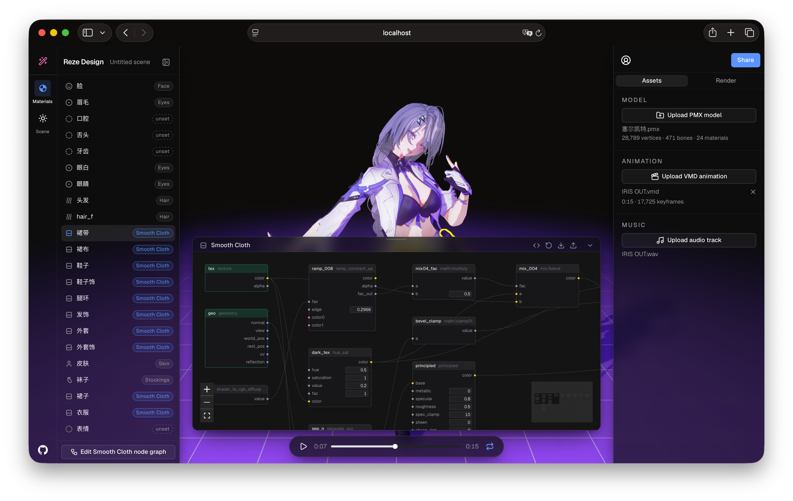

# Reze Design

Compose and style MMD scenes, then ship them. Bring a model, a motion, and a song — style the materials, light the scene, and export a finished "MMD" as a video and a permanent live-3D link. Built on the MMD WebGPU engine [reze-engine](https://github.com/AmyangXYZ/reze-engine).



## Features

- **Compose a scene** — load a model (PMX), a motion (VMD), and a music track; a demo loads on first open.
- **Style every material** — group materials into looks and apply them in one click from the shader library.
- **Author shaders visually** — build looks in a Blender-style node graph, compiled to WGSL and applied live.
- **Light the scene** — tune the sun, bloom, ground, and world color, all live in the viewport.
- **Play it back** — scrub and loop with the music synced to the motion; Space toggles playback.

## Development

```bash
npm install
npm run dev
```

## Roadmap

reze-design is a curated MMD platform — an aesthetic with built-in looks (think camera filters), not a general 3D DCC. Next up:

- **Scenes, not a void** — curated backgrounds (sky / ocean / indoor, including 360° images) and stage support, so a model lives in a scene instead of on a debug ground.
- **Built-in looks** — a growing shader-graph library plus post filters (bloom, rim light, color grade) tuned for the MMD aesthetic.
- **Share a live link** — publish a scene as a real-time, interactive 3D page at `reze.design/<user>/<scene>`, not a flat video.
- **Gallery** — browse and remix shared scenes and looks.

## License

[AGPL-3.0-or-later](LICENSE).
