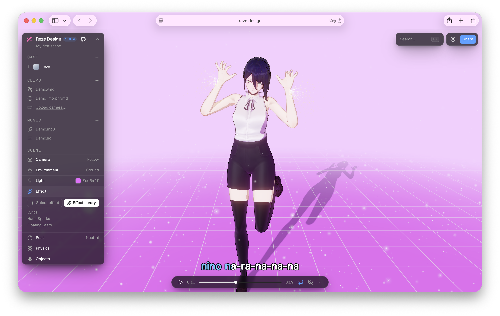

# Reze Design

Turn an MMD dance into a live, shareable 3D performance. Bring a model, a motion, and a song — style the character, light it, and publish an interactive 3D link, not a flat video. Built on the MMD WebGPU engine [reze-engine](https://github.com/AmyangXYZ/reze-engine).



## Features

- **Compose a scene** — load a model (PMX folder or zip — drag & drop works too), a motion + camera VMD, and a music track; a demo loads on first open. Swapping models keeps the current dance.
- **Style every material** — group materials into looks and apply them in one click from the shader library.
- **Author shaders visually** — build looks in a Blender-style node graph (localized node names, Blender-style shortcuts, node rename), compiled to WGSL and applied live.
- **Set the scene** — sun, world light, and bloom; a background color, a flat image backdrop, or a **360° panorama skybox** that follows the camera; ground with opacity (the shadow stays — a shadow catcher), shadow and grid toggles.
- **Play it back** — scrub and loop with the music synced to the motion; Space toggles playback; camera VMD follow/free toggle.
- **Render to video** — frame-accurate 60 fps mp4 export in the browser (WebCodecs hardware encode): aspect 16:9 / 9:16 / 1:1 / 4:3 × quality 1080p / 1440p / 4K, a **green-screen mode** for compositing in external editors (live-previewed in the viewport), and an optional watermark.
- **Three languages** — English / 中文 / 日本語, one click away.
- **Runs on phones** — WebGPU + WebCodecs; a short clip renders on a mid-range Android.

## Development

```bash
npm install
npm run dev
```

## Roadmap

reze-design is a curated MMD platform — an aesthetic with built-in looks (think camera filters), not a general 3D DCC. The focus is the character and its dance, presented well. Next up:

- **Share a live link** — publish your scene as a real-time, interactive 3D page at `reze.design/<user>/<scene>`, not a flat video.
- **More built-in looks** — a growing shader-graph library and post filters tuned for the MMD aesthetic.
- **Gallery** — browse and remix shared scenes and looks.
- **Mobile layout** — a proper small-screen shell (the editor already runs there).

## License

[AGPL-3.0-or-later](LICENSE).
