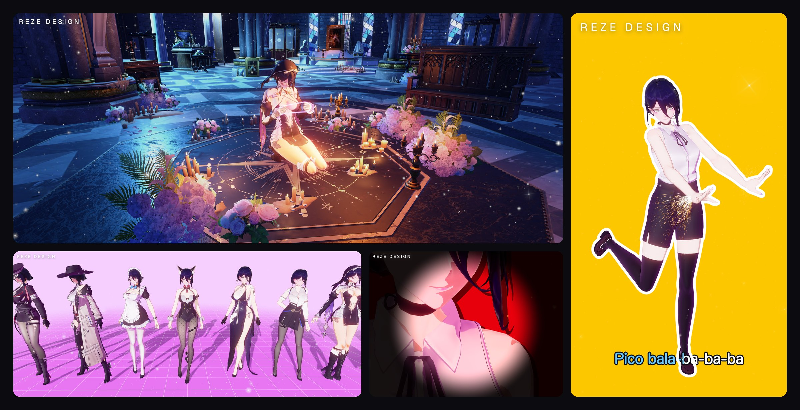

# Reze Design

**The authentic MMD experience, reforged in WebGPU and TypeScript.** MMD design, rendering and sharing in the browser — models, motions, camera, stage, effects — with nothing to install and a permanent link anyone can open.

**→ [reze.design](https://reze.design)** · **▶ [Watch the 1.0 teaser](https://youtu.be/jZdjWSM0bkI)**

## Features

- **MMD, played the way MMD plays it** — PMX and VMD with IK, morphs and rigid-body physics for hair and cloth, several characters at once.
- **Stages, PMX or GLB** — a classic PMX stage folder, or a single `.glb` from Blender that brings its lamps, sun and world and is lit the way Blender lit it.
- **Rendering styles** — game looks ported as node graphs and applied in one click, such as *Aether Gazer*, *Wuthering Waves*, *Zenless Zone Zero* and *Honkai: Star Rail*. Build your own in the graph editor and publish it.
- **Material shader graphs** — a Blender-style node editor, compiled to WGSL as you work.
- **Scene effects** — live-coded WGSL effects that hold the scene's depth, so rain and petals pass behind the character. They run GPU particles, emit real lights, and react to the bones, the song and the lyrics.
- **Animation timeline and curve editor** — grab a bone in the viewport, drag it, and the pose is keyed. Saves as VMD any MMD tool can read.
- **Lip sync from the lyrics** — one click turns a `.lrc` into a mouth-morph VMD, in kana, hangul, hanzi, romaji, pinyin or English.
- **Lighting and grading** — sun, lamps, HDR worlds and bloom, with ASC CDL colour wheels on top.
- **Video export** — 60 fps mp4 up to 4K at 4× MSAA, with green-screen and alpha modes. Rendered frame by frame, so nothing drops and the music lands on the same frame every time.
- **Publishing** — a permanent URL that plays the scene itself: anyone can orbit the camera while it runs, or take a copy into their own editor.
- **Nothing lost** — everything saves as you work, locally; nothing reaches a server unless you publish.

Built on [reze-engine](https://github.com/AmyangXYZ/reze-engine), a WebGPU engine made for MMD with zero third-party dependencies.

One piece of the **Reze MMD family**, covering the whole MMD workflow on the web:

|                                                         |                                                                                |
| ------------------------------------------------------- | ------------------------------------------------------------------------------ |
| [reze-engine](https://github.com/AmyangXYZ/reze-engine) | The WebGPU foundation — anime-character rendering and physics, dependency-free |
| **reze-design**                                         | This repo — MMD design, rendering and sharing                                  |
| [reze-studio](https://github.com/AmyangXYZ/reze-studio) | Animation editing on a professional timeline and curve editor                  |
| [MiKaPo](https://github.com/AmyangXYZ/MiKaPo)           | Real-time motion capture in the browser, exporting straight to VMD             |
| [reze-rig](https://github.com/AmyangXYZ/reze-rig)       | Retarget FBX animations to MMD VMD format, Mixamo and Unity tested             |

**[User manual](./docs/manual/en.md)** · [简体中文](./docs/manual/zh.md) — what MMD is, every panel, and how to author grades, WGSL background effects and shader graphs.

## License

[AGPL-3.0-or-later](LICENSE).
