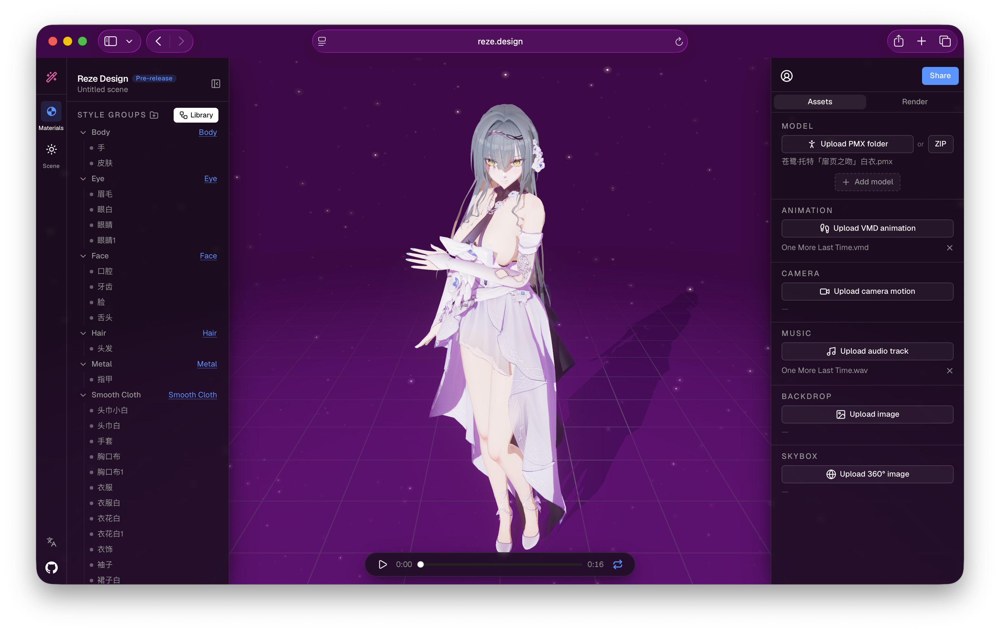
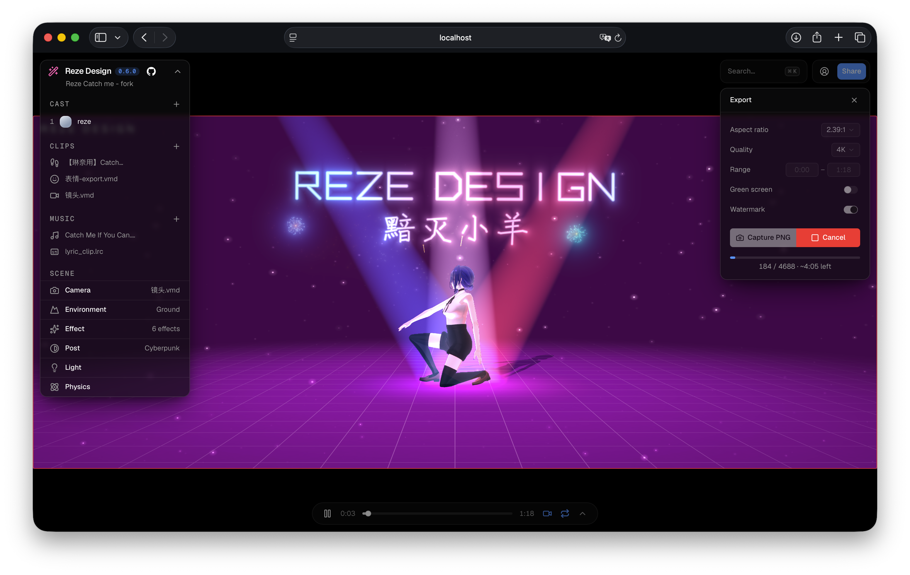
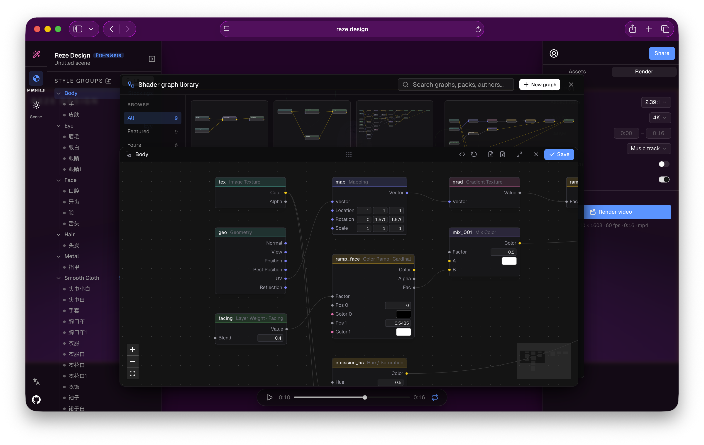
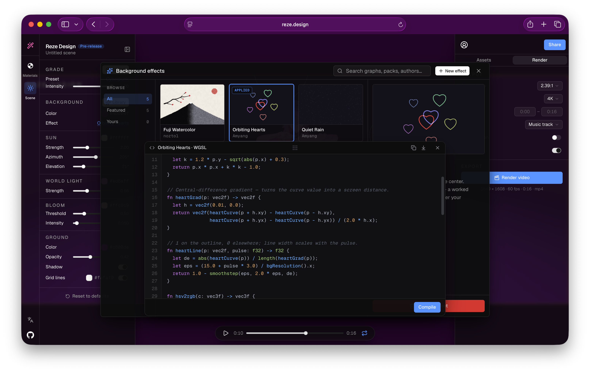

# Reze Design

An MMD design, rendering and sharing platform, in the browser. Bring a model, a motion and a song, decide how it all looks — material shaders you build as node graphs, colour grading, live-coded WGSL background effects, lighting and framing — then export 4K 60 fps video locally or publish a permanent link anyone can open and orbit in real time. It runs on its own engine, [reze-engine](https://github.com/AmyangXYZ/reze-engine): WebGPU, built for anime characters, zero third-party dependencies — Bullet physics included, ported to pure TypeScript, no WASM.

One piece of the **Reze MMD family**, covering the whole MMD workflow on the web:

|                                                         |                                                                                |
| ------------------------------------------------------- | ------------------------------------------------------------------------------ |
| [reze-engine](https://github.com/AmyangXYZ/reze-engine) | The WebGPU foundation — anime-character rendering and physics, dependency-free |
| **reze-design**                                         | This repo — scene design, rendering and sharing                                |
| [reze-studio](https://github.com/AmyangXYZ/reze-studio) | Animation editing on a professional timeline and curve editor                  |
| [MiKaPo](https://github.com/AmyangXYZ/MiKaPo)           | Real-time motion capture in the browser, exporting straight to VMD             |
| [reze-rig](https://github.com/AmyangXYZ/reze-rig)       | Retarget FBX animations to MMD VMD format, Mixamo and Unity tested           |

**[User manual](./docs/manual/en.md)** · [简体中文](./docs/manual/zh.md) — what MMD is, every panel, and how to author grades, WGSL background effects and shader graphs.



## Features

- **Material shader graphs** — build a look in a Blender-style node editor, compiled to WGSL.
- **Colour grading** — ASC CDL, curated presets and a wheel editor, previewed on your own scene.
- **Scene effects** — live-coded WGSL behind the model, in front of it, or both; the ones in front hold the scene's depth, so rain and petals are occluded by the character they pass behind.
- **Scene lighting** — sun, world light and bloom over a colour, an image backdrop or a 360° skybox.
- **Multi-model scenes** — a motion each, one camera VMD, one audio track.
- **Stage models** — a stage PMX as the environment, placed and scaled, with the switches its author rigged.
- **Stage material presets** — fifteen stage looks, matched against a stage's own material names in Japanese, Chinese or English.
- **Command palette** — ⌘K for every action and every setting, and what it is set to.
- **Video export** — 60 fps mp4 up to 4K, cinemascope to vertical, with a green-screen mode.
- **Still capture** — a PNG at the export's framing.
- **Publishing** — a permanent URL anyone can open and orbit.
- **Open in editor** — take any published scene as your own copy, out of what its page already loaded.
- **Gallery** — everything published, your own, or what you liked, narrowed by tag.
- **Accounts** — GitHub or Google, and a handle you own.
- **Nothing lost** — every edit survives a refresh, uploads included, and nothing reaches a server until you publish.
- **Scene files** — the whole scene as one zip, out and back in.



## Authoring shaders



Materials are styled per **style group** — a set of materials sharing one look —
by a **shader graph**: a Blender-style node editor compiled to WGSL by
reze-engine, with toon ramps, rim and fresnel, HSV, noise and Principled BSDF
nodes, and the scene's light available as values so a graph can build its own
diffuse term. Graphs are plain JSON, compile errors surface as diagnostics rather
than throws, and exposed params adjust live without a recompile.
→ [manual §2.4](./docs/manual/en.md#24-material-shader-graphs)

Two built-in sets ship as reference implementations: **AG**, built around a
lighting closure and a ramp, and **WuWa**, built around the light directly — a
half-Lambert through a narrow soft threshold, a shadow that warms as it turns,
the model's own sphere-map highlight. Neither carries an image of its own, so both
apply to any model, and either can be applied to a whole scene from the command
palette — every group restyled role for role, with the view transform and world
light the set was authored under.

Node semantics track Blender 5.2. The manual carries the whole authoring
contract — every node's sockets, the two spines graphs are built on,
the rules a document is checked against, and how a Blender material translates —
so a graph can be written or generated from the document alone and imported as
JSON.
→ [writing a graph](./docs/manual/en.md#writing-a-graph-that-compiles) ·
[coming from Blender](./docs/manual/en.md#coming-from-blender)



A scene effect is WGSL rendered per pixel, and it says where it goes by which
functions it defines — `fn background(ray, uv, time)` between the background
layer and the model, `fn foreground(ray, uv, time, depth)` over the finished
frame. There is no layer setting: one library, one editor, and a file that
defines both is one weather system. `depth` is how far away the scene is at that
pixel, so a foreground can be occluded by the character rather than pasted over
it — compare a particle's own distance against it, or read it directly, since
fog's opacity simply is a function of distance. Edit in-app with the scene as the
live preview; a failed compile keeps the previous shader and lists `line:col`
diagnostics.
→ [manual §2.3](./docs/manual/en.md#23-scene-effects-in-wgsl)

Colour grades are ASC CDL — curated presets, a wheel-based editor, split toning.
→ [manual §2.2](./docs/manual/en.md#22-colour-grades)

## Content library

Grades, shader graphs and scene effects share one envelope
(`lib/library.ts`) and travel as data. Built-ins ship in the repo
(`content/*.json`), so a clone runs with no server; community items merge in
from the database at runtime. Published items are **immutable versions**:
publishing over your own item writes version _n+1_, and a scene pins the exact
`{ id, version }` it used, so nobody's scene changes under them when an author
retunes a preset.

Editing is a scratchpad, and one rule covers all three: **what you keep lives in
Local, what you don't is gone.** Your own drafts save as you work, straight to
local storage, so closing one is just closing it. Editing a built-in, someone
else's published item, or a look built directly on a style group writes nothing
until you close — then it asks whether to keep the result as a draft. Decline and
it is discarded, including from the scene you were previewing it in. Publishing
is what turns a draft into a library item everyone can see. Graphs and grades
also import and export as JSON, so a look can be hand-written, generated or
passed around with no scene and no account.

## Publishing

**Share** packs the models, motions and audio you uploaded into one archive,
uploads it from the browser straight to object storage, and publishes the
document that points at it. A scene needs a name, description, tags, a
thumbnail and **credits** — naming the artists behind the model, motion and
music is required. The URL is `reze.design/<handle>/<short-id>`; the short id
is what resolves, so renaming a scene or an author never breaks a link.

**Open in editor**, on a published scene's page, brings the whole thing back as
your own copy. It opens from the assets that page had already downloaded to
render what you were watching, so forking a scene does not fetch its models a
second time.

## Development

```bash
npm install
npm run dev
```

No configuration is needed to run the editor. Without a database the app still
builds and boots: models load, materials and shader graphs work, video and PNG
export work, and every built-in grade, effect and graph is browsable. The parts
that need a server — accounts, publishing, the gallery — report that they are
unavailable instead of failing.

Set `NEXT_PUBLIC_USE_DEFAULT_ASSETS=false` at build time to boot into an empty
scene instead of the bundled demo — for desktop packaging or self-hosting without
shipping the demo model.

## Roadmap

A curated MMD platform built around the character and its dance. Next up:

- **Timeline editing** — a shared time axis with a playhead across the lanes, then per-track trim and offset.
- **Global effects** — WGSL effects in front of the scene as well as behind it.
- **Sphere-map highlights** — MMD's specular maps in the shader graph, for the highlight hair textures already carry.
- **More built-ins** — a growing shader-graph and colour-grade library tuned for the MMD aesthetic.
- **Mobile layout** — a proper small-screen shell (the editor already runs there).

## License

[AGPL-3.0-or-later](LICENSE).
