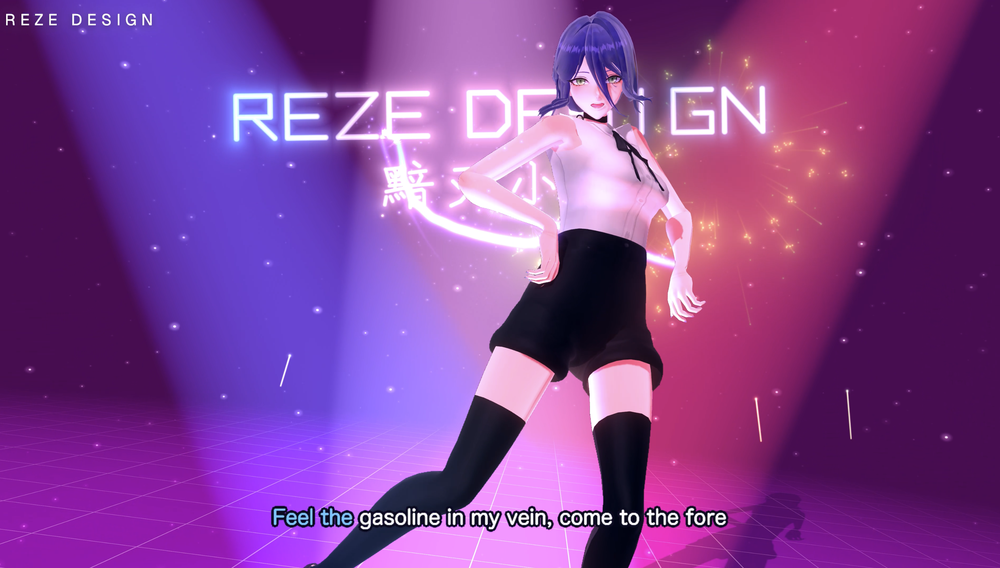
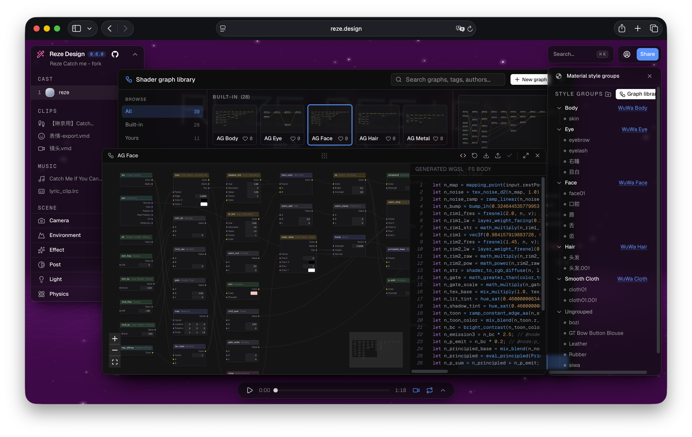
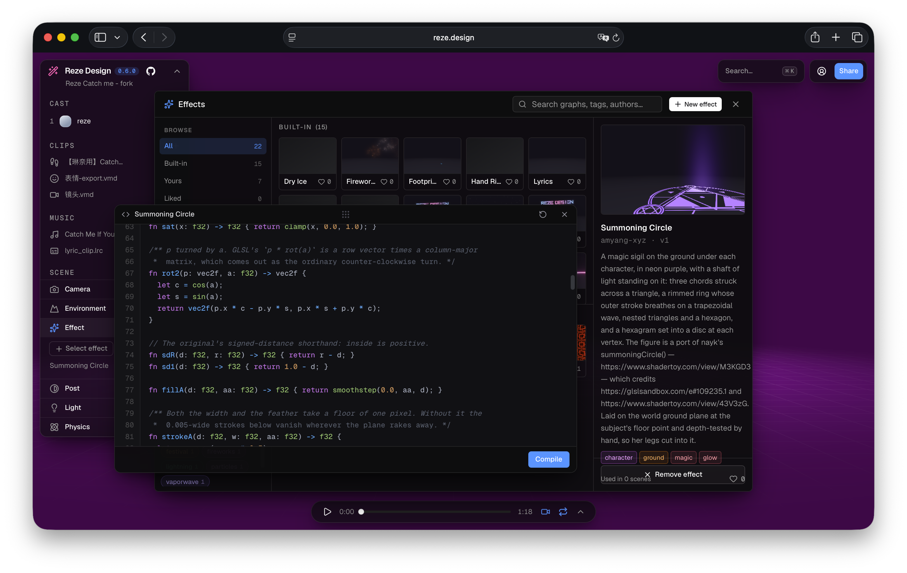
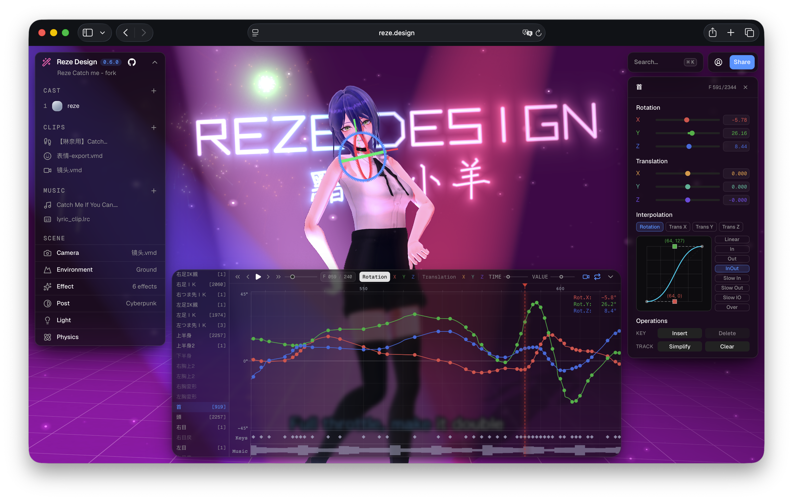
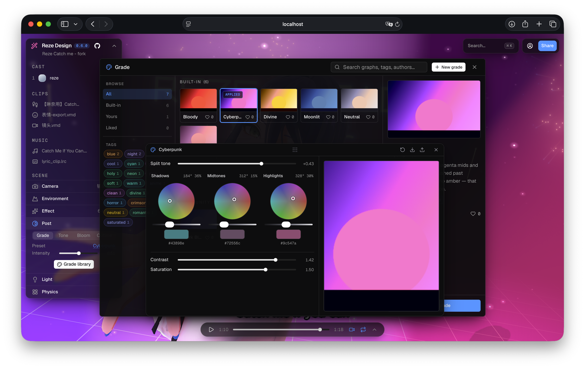
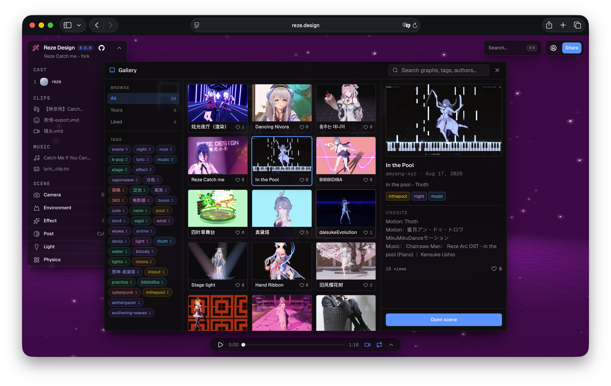
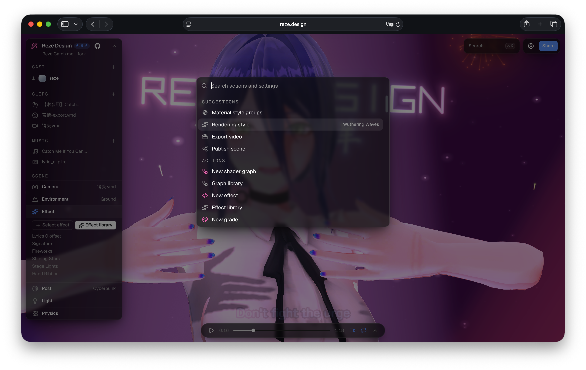

# Reze Design

**The authentic MMD experience, resurrected in WebGPU and TypeScript.** Design, render and share MMD scenes in the browser: everything the 2008 desktop made possible — models, motions, camera work, MME effects — alive again in a tab. Nothing to install, and a permanent link anyone can open.

Every part of it is next-generation. WGSL scene effects compiled in real-time as you type. Blender-style node graphs for materials. Motion, morph and camera editing on a real timeline. Lyrics, MIDI and one-click lip sync. 4K 60 fps export at 4× MSAA. Next.js and TypeScript end to end, on a rendering engine of its own — [reze-engine](https://github.com/AmyangXYZ/reze-engine), built for MMD, zero third-party dependencies.

One piece of the **Reze MMD family**, covering the whole MMD workflow on the web:

|                                                         |                                                                                |
| ------------------------------------------------------- | ------------------------------------------------------------------------------ |
| [reze-engine](https://github.com/AmyangXYZ/reze-engine) | The WebGPU foundation — anime-character rendering and physics, dependency-free |
| **reze-design**                                         | This repo — scene design, rendering and sharing                                |
| [reze-studio](https://github.com/AmyangXYZ/reze-studio) | Animation editing on a professional timeline and curve editor                  |
| [MiKaPo](https://github.com/AmyangXYZ/MiKaPo)           | Real-time motion capture in the browser, exporting straight to VMD             |
| [reze-rig](https://github.com/AmyangXYZ/reze-rig)       | Retarget FBX animations to MMD VMD format, Mixamo and Unity tested             |

**[User manual](./docs/manual/en.md)** · [简体中文](./docs/manual/zh.md) — what MMD is, every panel, and how to author grades, WGSL background effects and shader graphs.

## Features

- **MMD models and motions** — PMX and VMD played the way MMD plays them: skeletal animation, IK, morphs, and rigid-body physics for hair and cloth. Several characters at once, and a stage PMX for the environment.
- **Material shader graphs** — style a model in a Blender-style node editor, compiled to WGSL as you work: toon ramps, rim and fresnel, with the scene's own light available to the graph.
- **Scene effects** — live-coded WGSL behind the model or in front of it, holding the scene's depth so rain and petals pass behind the character; several can run at once, composited in the order you apply them. An effect runs a hundred thousand GPU particles or a ribbon along a bone, emits real lights that illuminate the cast, and reads where the bones are, where the song is, and the notes and lyric line due on screen.
- **Animation timeline and curve editor** — grab a bone in the viewport, drag it, and the pose is keyed; bend the VMD's own bezier until the move lands exactly when you want it. Fix a motion you downloaded, animate the face, cut the camera — and it all saves as VMD any MMD tool can read.
- **Colour grading** — ASC CDL underneath, colour wheels on top: warm the shadows, cool the highlights, and see it on your own scene instead of a swatch.
- **Scene lighting** — place the sun, set the world light, tune the bloom. Drop in an HDR skybox and it lights the character as well as standing behind her.
- **Video export** — 60 fps mp4 up to 4K, cinemascope to vertical, with a green-screen mode. Rendered frame by frame rather than screen-captured, so nothing drops and the music lands on the same frame every time.
- **Publishing** — a permanent URL that plays the scene itself, not a video of it: anyone can open the link, orbit the camera while it runs, and take the whole thing into their own editor as a copy.
- **Community content** — someone else's grade, shader graph or effect is one click from your scene, and yours is one click from theirs. Scenes too.
- **Command palette** — ⌘K for every action and every setting, and what it is set to.
- **Nothing lost** — everything is saved as you work: the scene, the uploads, every draft, written to local storage and IndexedDB. Close the tab, reload, come back tomorrow — it is all still there, and none of it reaches a server unless you publish.
- **Lip sync from the lyrics** — one click turns a `.lrc` into a mouth-morph VMD, syllable by syllable onto the five MMD mouth shapes, in kana, hangul, hanzi, romaji, pinyin or English.

Authoring in depth — [shader graphs](./docs/manual/en.md#24-material-shader-graphs) ·
[scene effects](./docs/manual/en.md#23-scene-effects-in-wgsl) ·
[colour grades](./docs/manual/en.md#22-colour-grades)

## License

[AGPL-3.0-or-later](LICENSE).
